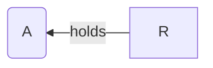
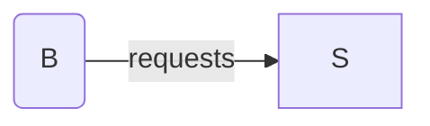
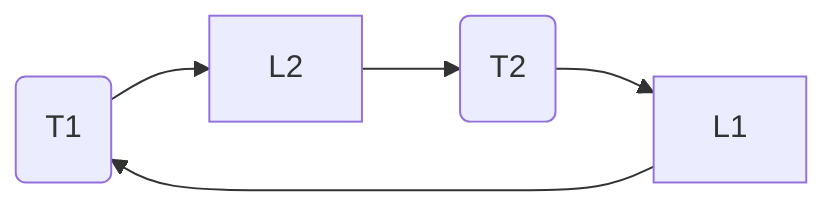

Deadlocks are one of the fundamental hazards in [[🚴‍♂️ Concurrency]] as threads acquiring resources generate dependencies simultaneously. Locks, semaphores, etc. protect resources, and incorrect use of synchronization can block all threads.

Deadlock is a problem that can arise when:
- Threads compete for access to limited resources
- Threads are incorrectly synchronized

Deadlock exists among a set of threads if every thread is waiting for an event that can be caused only by another thread in the set.
# Conditions
Deadlock can exist iff the following conditions hold **simultaneously**:
- Mutual exclusion: A resource is assigned to at most one thread at once
- Hold and wait: Threads holding resources can request new resources while continuing to hold old resources
- No preemption: Resources cannot be taken away once obtained
- Circular wait: One thread waits for another in a circular fashion

Eliminating any of these conditions eliminates deadlock.
# Resource Allocation Graph
Allows us to illustrate deadlocks.

---
Thread A holds resource R:

Thread B requests resource S

---
If the graph has a cycle, then a deadlock may exist. If no cycles, no deadlock.

Example: Thread 1 holds Lock 1, Thread 2 holds Lock 2, Each requests the others' lock

# Multi-Unit vs. Single-Unit Resources
- Multiple resources of some types.
	- If the graph has a cycle, deadlock may exist
- Single resource of each type.
	- If the graph has a cycle, deadlock exists.
	- Useful for tracking locks.
# Preventing Deadlocks
- No mutual exclusion, make resources shareable. This isn't always possible.
- No hold and wait:
	- Threads cannot hold one resource while requesting another
	- Threads try to lock all resources at once at the beginning
- Preemption: OS can preempt resources (costly)
- No circular wait:
	- Impose an order on all resources, request in order
	- Popular OS implementation technique when using multiple locks
#### Ostrich Algorithm
Just assume the deadlock won't happen. :)

Used in systems like Unix because:
- Deadlocks are rare
- Detection/recovery is expensive or complex
- Easier to just restart the affected processes if needed.
# Avoidance
- Specify in advance what resources will be needed by threads
- System only grants resources requests if it knows that the process can obtain all resources it needs in future requests
- Avoids circular dependencies
- Banker's Algorithm
	- Only allocates resources if there is some scheduling order in which every thread can complete
- Hard to determine all resources needed in advance
# Detection
- Traverse the resource graph looking for cycles
- Expensive, as many threads and resources are needed to traverse
- Detection algorithm is invoked depending on:
	- How often or likely the deadlock is
	- How many threads are likely to be affected when it occurs
# Recovery
Once a deadlock is detected, we have two options:
- **Abort Threads**
	- Abort all deadlocked threads, threads would need to start over again
	- Abort one thread at a time until the cycle is elimated, system needs to rerun detection after each abort
- **Preempt resources** => Force their release
	- Select thread and resource to preempt
	- Roll back thread to previous state