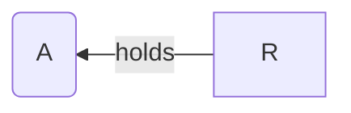
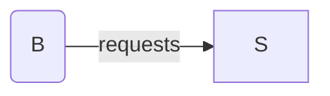
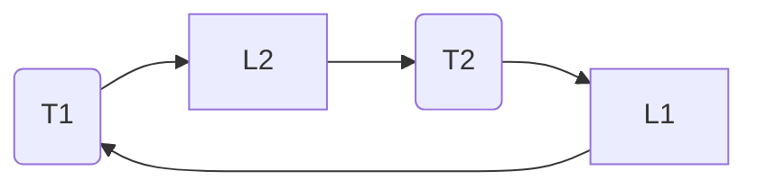

deadlocks are one of the fundamental hazards in [[🚴‍♂️ Concurrency|🚴‍♂️ concurrency]] as threads acquiring resources generate dependencies simultaneously. locks, semaphores, etc. protect resources, and incorrect use of synchronization can block all threads.

deadlock is a problem that can arise when:
- threads compete for access to limited resources
- threads are incorrectly synchronized

deadlock exists among a set of threads if every thread is waiting for an event that can be caused only by another thread in the set.
# conditions
deadlock can exist iff the following conditions hold **simultaneously**:
- mutual exclusion: a resource is assigned to at most one thread at once
- hold and wait: threads holding resources can request new resources while continuing to hold old resources
- no preemption: resources cannot be taken away once obtained
- circular wait: one thread waits for another in a circular fashion

eliminating any of these conditions eliminates deadlock.
# resource allocation graph
allows us to illustrate deadlocks.

---
thread a holds resource r (allocation edge):

thread b requests resource s (request edge):

---
>[!important]
>if the graph has a cycle, then a deadlock may exist. if no cycles, no deadlock.

example: thread 1 holds lock 1, thread 2 holds lock 2, each requests the others' lock

# multi-unit vs. single-unit resources
- multiple resources of some types.
	- if the graph has a cycle, deadlock may exist
- single resource of each type.
	- if the graph has a cycle, deadlock exists.
	- useful for tracking locks.
# preventing deadlocks
- no mutual exclusion, make resources shareable. this isn't always possible.
- no hold and wait:
	- threads cannot hold one resource while requesting another
	- threads try to lock all resources at once at the beginning
- preemption: os can preempt resources (costly)
- no circular wait:
	- impose an order on all resources, request in order
	- popular os implementation technique when using multiple locks
#### ostrich algorithm
just assume the deadlock won't happen. :)

used in systems like unix because:
- deadlocks are rare
- detection/recovery is expensive or complex
- easier to just restart the affected processes if needed.
# avoidance
- specify in advance what resources will be needed by threads
- system only grants resources requests if it knows that the process can obtain all resources it needs in future requests
- avoids circular dependencies
- banker's algorithm
	- only allocates resources if there is some scheduling order in which every thread can complete – the resulting state is safe
- hard to determine all resources needed in advance
# detection
- traverse the resource graph looking for cycles
- expensive, as many threads and resources are needed to traverse
- detection algorithm is invoked depending on:
	- how often or likely the deadlock is
	- how many threads are likely to be affected when it occurs
# recovery
once a deadlock is detected, we have two options:
- **abort threads**
	- abort all deadlocked threads, threads would need to start over again
	- abort one thread at a time until the cycle is elimated, system needs to rerun detection after each abort
- **preempt resources** => force their release
	- select thread and resource to preempt
	- roll back thread to previous state